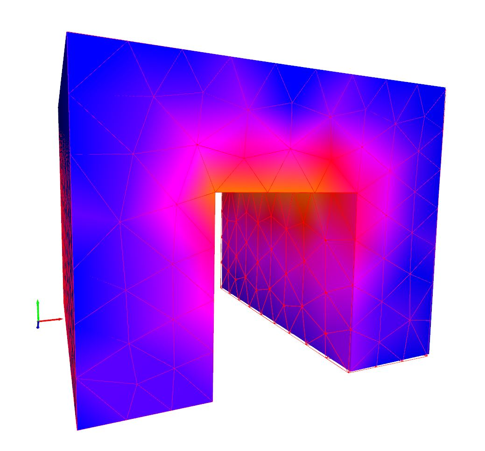

# NLFEM

非線形有限要素法(弾塑性解析)の実装．学習を目的としており，すべてのコードはPythonで記述されている．

## Requirement

* python 3.6
* open3d 0.8.0.0

## Installation

public/env/にymlファイルを同梱しているため，Anacondaの仮想環境にimportすることで環境構築ができる．すべてのコードはPythonで記述されているため，仮想環境のターミナル上でPythonファイルを実行するだけでよい．

## Usage

解析済みの結果を復元して表示するにはsrc/restore.pyを実行する．実行環境は，Anacondaの仮想環境を想定している．

```cmd
python src/restore.py
```

解析を実行するには，src/solve.pyを実行する．

```cmd
python src/solve.py
```

インクリメントごとの収束比はターミナル上に出力される．


in/case1.txtの解析結果は画像のようになる．



色と節点スカラー値の対応もターミナル上に出力される．画像は最大主応力のヒートマップである．


自分で用意したモデルを解析する場合は，in/format.txtのフォーマットに従って入力データを作成する．設定できる境界条件は，節点の固定と集中荷重である．材料定数は，ヤング率200GPa，ポアソン比0.3，初期降伏応力295MPaとして自動で設定され，降伏条件はVon Misesである．要素タイプは一次の四面体要素のみである．材料や要素タイプの定義は必要に応じて適宜編集・追加してほしい．

## References

E.A. De Souza Neto, D.R.J. Owen : 非線形有限要素法 弾塑性解析の理論と実践
